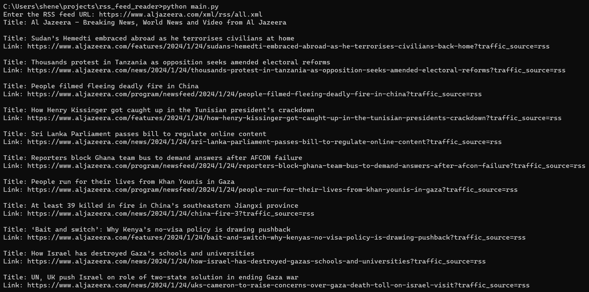

# RSS Feed Reader

This is a Python application for fetching and displaying the latest news articles or blog posts from RSS feeds. It provides a command-line interface for users to input the RSS feed URL and see the titles and links to the articles.

## Features

- Fetch and display the latest articles from an RSS feed.
- Simple command-line interface.
- No external dependencies; uses the feedparser library to parse RSS feeds.

## Project Structure

- `main.py`: Main Python script for the application.
- `requirements.txt`: List of project dependencies.

## Usage

1. Clone or download this repository to your local machine.
2. Set up a Python environment (virtual environment recommended).
3. Install the required library:
   - pip install feedparser
4. Run the RSS Feed Reader:
   - python main.py
5. Enter the RSS feed URL when prompted.
6. The application will fetch and display the latest articles from the provided feed.

## Dependencies

This project relies on the feedparser library for parsing RSS feeds. It doesn't have any other external dependencies.

## License

This project is open-source and available under the [MIT License](LICENSE).